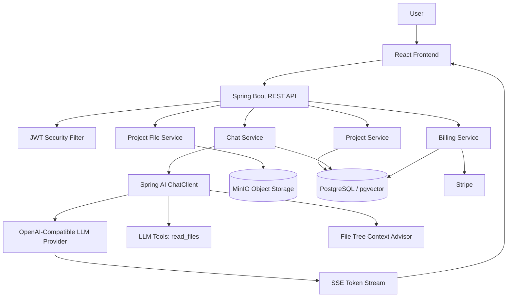
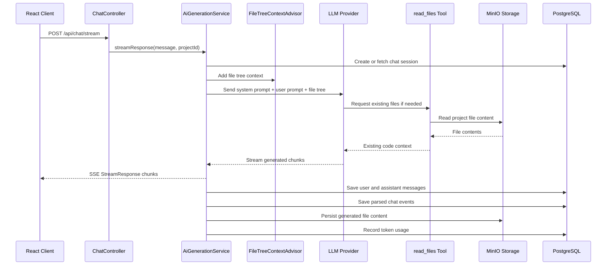
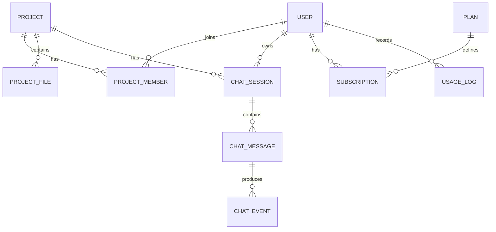
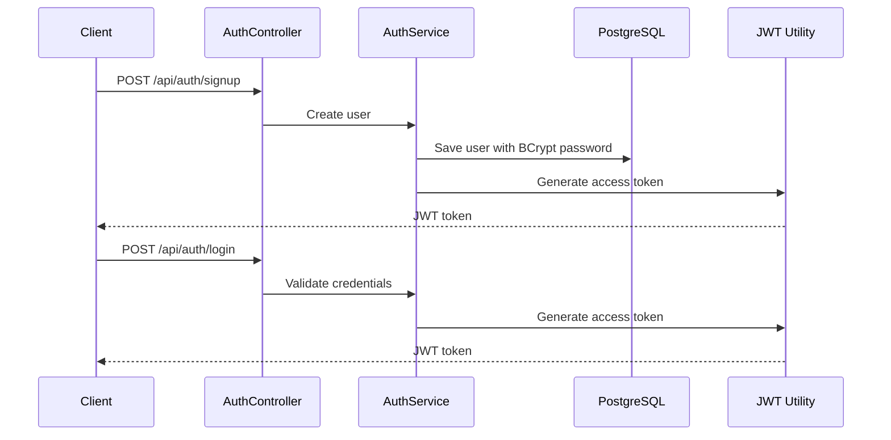

# AI-Driven Code Generation SaaS Platform

A Spring Boot based AI code generation SaaS backend that generates and manages complete React application projects from natural language prompts. The platform combines Spring AI, LLM streaming, MinIO object storage, JWT authentication, role-based project access, Stripe billing, and subscription-aware usage control to support a multi-tenant Lovable-style application builder.

> This repository currently contains the backend API and infrastructure configuration for the AI code generation platform. It is designed to power a React frontend that sends prompts, receives real-time streamed AI output, and displays generated project files.

---

## Table of Contents

- [Project Overview](#project-overview)
- [Why This Project Exists](#why-this-project-exists)
- [Core Features](#core-features)
- [High-Level Architecture](#high-level-architecture)
- [AI Code Generation Workflow](#ai-code-generation-workflow)
- [Technology Stack](#technology-stack)
- [Backend Module Breakdown](#backend-module-breakdown)
- [Database Model](#database-model)
- [MinIO Object Storage Design](#minio-object-storage-design)
- [Authentication and Authorization](#authentication-and-authorization)
- [Subscription and Billing Flow](#subscription-and-billing-flow)
- [API Documentation](#api-documentation)
- [Project Structure](#project-structure)
- [Local Setup](#local-setup)
- [Environment Configuration](#environment-configuration)
- [Running the Application](#running-the-application)
- [Testing the APIs](#testing-the-apis)
- [SSE Streaming Example](#sse-streaming-example)
- [Docker Services](#docker-services)
- [Scalability Notes](#scalability-notes)
- [Security Notes](#security-notes)
- [Resume Highlights](#resume-highlights)
- [Future Enhancements](#future-enhancements)

---

## Project Overview

This project is an AI-powered SaaS backend inspired by platforms like Lovable, Bolt, and v0. A user creates a project, enters a natural language prompt such as:

```text
Build a modern dashboard for a SaaS analytics product with authentication, pricing cards, charts, and a responsive layout.
```

The backend sends the prompt to an LLM using Spring AI. The LLM receives the current project file tree as context, reads required files through tool calls, generates React/TypeScript code, streams the response token-by-token to the frontend using Server-Sent Events, parses generated file outputs, and persists the final source code in MinIO.

The platform supports important SaaS concerns such as:

- User signup and login
- JWT authentication
- Project ownership and collaboration
- Role-based permissions
- AI token usage tracking
- Subscription plan limits
- Stripe checkout and customer portal integration
- Persistent generated project storage
- PostgreSQL-backed metadata management
- MinIO-backed source-code object storage

---

## Why This Project Exists

Most AI code generation demos only call an LLM and print text. This project goes beyond that by implementing the backend foundation required for a real SaaS product:

1. **Streaming-first UX**  
   Users should not wait for the complete LLM response. The backend streams chunks as soon as they arrive.

2. **Persistent generated projects**  
   Generated source code is not temporary text. It is stored as project files and can be read, edited, and regenerated later.

3. **Context-aware generation**  
   The LLM receives the current file tree and can read existing files before modifying them.

4. **Multi-user SaaS model**  
   The backend supports users, projects, members, permissions, subscriptions, and usage controls.

5. **Production-style architecture**  
   The project separates controllers, services, repositories, DTOs, mappers, security, billing, AI orchestration, and storage concerns.

---

## Core Features

### 1. AI-Powered React Application Generation

- Generates React application code from natural language prompts.
- Uses Spring AI `ChatClient` to communicate with an OpenAI-compatible LLM provider.
- Uses a strict system prompt to instruct the LLM to generate structured XML-like outputs.
- Supports file-level generation using `<file path="...">...</file>` blocks.
- Parses generated files and saves them as project artifacts.

### 2. Real-Time Token Streaming with SSE

- Exposes a streaming endpoint using `text/event-stream`.
- Streams LLM chunks to the client in real time.
- Improves perceived latency during long code generation tasks.
- Uses Reactor `Flux` for asynchronous streaming.

### 3. Project and Workspace Management

- Users can create projects.
- Projects are initialized from a starter React template stored in MinIO.
- Project metadata is stored in PostgreSQL.
- Project files are stored in MinIO.
- Supports soft deletion using `deletedAt`.

### 4. File Tree and File Content APIs

- Provides APIs to fetch a project file tree.
- Provides APIs to read file content by path.
- Maintains file metadata in PostgreSQL while storing actual content in object storage.

### 5. LLM Tool Calling

- Provides a `read_files` tool to the LLM.
- The LLM can request existing files before generating updates.
- Prevents blind overwrites by encouraging read-before-edit generation.

### 6. File Tree Context Advisor

- Injects the current project file tree into the LLM prompt.
- Helps the model understand available files and project structure.
- Improves quality of generated code by grounding the model in current project state.

### 7. JWT Authentication

- Signup and login APIs.
- Password hashing using BCrypt.
- JWT token generation and validation.
- Stateless Spring Security configuration.

### 8. Role-Based Access Control

Project-level roles include:

| Role | Permissions |
|---|---|
| `OWNER` | View, edit, delete, manage members, view members |
| `EDITOR` | View, edit, delete, view members |
| `VIEWER` | View, view members |

Permissions are enforced using method-level security expressions such as:

```java
@PreAuthorize("@security.canEditProject(#projectId)")
```

### 9. Project Collaboration

- Invite members to a project.
- Update member roles.
- Remove members from a project.
- Store membership using a composite key of `projectId` and `userId`.

### 10. Subscription and Usage Controls

- Supports subscription plans.
- Plans define maximum projects, daily token limits, preview limits, and unlimited AI access.
- Usage logs track daily token consumption.
- Billing integration is handled through Stripe.

### 11. Stripe Billing Integration

- Create checkout sessions.
- Open Stripe customer portal.
- Handle Stripe webhooks.
- Activate, update, renew, cancel, and mark subscriptions as past due.

### 12. MinIO Object Storage

- Stores generated source code.
- Stores project templates.
- Uses object keys based on project ID and file path.
- Separates file metadata from file content.

---

## High-Level Architecture



---

## AI Code Generation Workflow



---

## Technology Stack

### Backend

| Technology | Purpose |
|---|---|
| Java 21 | Core programming language |
| Spring Boot 4 | Backend application framework |
| Spring Web MVC | REST API layer |
| Spring Security | Authentication and authorization |
| Spring Data JPA | ORM and repository layer |
| Hibernate | Entity persistence |
| Jakarta Validation | Request validation |
| Reactor Flux | Streaming response pipeline |
| Maven | Dependency management and build tool |

### AI

| Technology | Purpose |
|---|---|
| Spring AI | LLM integration abstraction |
| ChatClient | Prompting and streaming LLM responses |
| OpenAI-compatible API | LLM provider integration through OpenRouter-style base URL |
| Tool Calling | Allows model to read project files |
| Custom Stream Advisor | Injects file tree context into prompts |

### Storage and Database

| Technology | Purpose |
|---|---|
| PostgreSQL | Application metadata database |
| pgvector image | PostgreSQL service image used in Docker Compose |
| MinIO | S3-compatible object storage |
| JPA Entities | Users, projects, files, chats, billing, usage |

### Billing

| Technology | Purpose |
|---|---|
| Stripe Java SDK | Checkout, customer portal, subscriptions, webhooks |
| Stripe Webhooks | Subscription lifecycle updates |

### DevOps / Infrastructure

| Technology | Purpose |
|---|---|
| Docker Compose | Local PostgreSQL and MinIO services |
| Kubernetes-ready design | Stateless backend can be containerized and scaled |

---

## Backend Module Breakdown

### Controller Layer

| Controller | Base Path | Responsibility |
|---|---|---|
| `AuthController` | `/api/auth` | Signup, login, profile |
| `ProjectController` | `/api/projects` | Project CRUD |
| `FileController` | `/api/projects/{projectId}/files` | File tree and file content |
| `ChatController` | `/api/chat` | AI streaming and chat history |
| `ProjectMemberController` | `/api/projects/{projectId}/members` | Project collaboration and roles |
| `BillingController` | `/api/plans`, `/api/payments`, `/webhooks/payment` | Plans, subscription, Stripe checkout, portal, webhooks |
| `UsageController` | `/api/usage` | Usage tracking endpoints |

### Service Layer

| Service | Responsibility |
|---|---|
| `AuthService` | Signup, login, JWT response generation |
| `UserService` | User profile operations |
| `ProjectService` | Project creation, update, deletion, access checks |
| `ProjectTemplateService` | Initialize new projects from MinIO starter template |
| `ProjectFileService` | Read and write project files in MinIO |
| `AiGenerationService` | Stream AI responses, parse generated files, save chat events |
| `ChatService` | Retrieve chat history |
| `ProjectMemberService` | Invite, update, remove project members |
| `PlanService` | Fetch active subscription plans |
| `SubscriptionService` | Manage user subscription state |
| `UsageService` | Track and validate token usage |
| `PaymentProcessor` | Abstract payment operations |
| `StripePaymentProcessor` | Stripe-specific checkout, portal, webhook handling |

### AI Layer

| Class | Responsibility |
|---|---|
| `PromptUtils` | Central system prompt for code generation |
| `LlmResponseParser` | Parses `<message>`, `<tool>`, and `<file>` tags from LLM output |
| `FileTreeContextAdvisor` | Adds project file tree into the LLM prompt |
| `CodeGenerationTools` | Exposes `read_files` tool to the LLM |

### Security Layer

| Class | Responsibility |
|---|---|
| `WebSecurityConfig` | Stateless security filter chain |
| `JwtAuthFilter` | Extracts and validates Bearer tokens |
| `AuthUtil` | JWT generation, verification, current user lookup |
| `JwtUserPrincipal` | Authenticated user principal |
| `SecurityExpressions` | Project permission checks for `@PreAuthorize` |

---

## Database Model

The application stores metadata in PostgreSQL and stores actual generated file contents in MinIO.

### Main Entities

| Entity | Purpose |
|---|---|
| `User` | Platform user account with login credentials and Stripe customer ID |
| `Project` | AI-generated app workspace |
| `ProjectMember` | User membership and role in a project |
| `ProjectFile` | Metadata for project files stored in MinIO |
| `ChatSession` | Conversation between a user and project |
| `ChatMessage` | User or assistant message in a chat session |
| `ChatEvent` | Parsed assistant events such as messages, tool logs, and file edits |
| `Plan` | Subscription plan with limits |
| `Subscription` | User's active/cancelled/past-due subscription state |
| `UsageLog` | Daily token usage per user |
| `Preview` | Preview lifecycle model for generated app execution |

### Conceptual ER Diagram



---

## MinIO Object Storage Design

The system uses MinIO as S3-compatible object storage.

### Buckets

| Bucket | Purpose |
|---|---|
| `starter-projects` | Stores starter React templates |
| `projects` | Stores generated project files |

### Object Key Pattern

Generated project files are stored with this pattern:

```text
projects/{projectId}/{relativeFilePath}
```

Example:

```text
projects/12/src/App.tsx
projects/12/src/components/Navbar.tsx
projects/12/package.json
```

### Why MinIO Is Used

- Keeps large file content outside the relational database.
- Makes generated projects easier to export later.
- Provides S3-compatible APIs.
- Allows local development without requiring AWS S3.
- Supports scalable file storage for multi-tenant SaaS usage.

---

## Authentication and Authorization

### Authentication Flow



### Authorization Header

Protected endpoints require a Bearer token:

```http
Authorization: Bearer <jwt-token>
```

### Project Authorization

The backend checks project permissions through `SecurityExpressions`.

Example:

```java
public boolean canEditProject(Long projectId) {
    return hasPermission(projectId, ProjectPermission.EDIT);
}
```

---

## Subscription and Billing Flow

The platform uses Stripe for subscription billing.

### Billing Capabilities

- Fetch active plans.
- Create Stripe checkout session.
- Open Stripe customer portal.
- Process Stripe webhooks.
- Activate subscription after successful checkout.
- Update subscription on Stripe lifecycle events.
- Mark subscriptions as past due on failed invoice payments.
- Cancel subscriptions when Stripe sends deletion events.

### Stripe Webhook Events Handled

| Stripe Event | Backend Action |
|---|---|
| `checkout.session.completed` | Activate user subscription |
| `customer.subscription.updated` | Update subscription status, period, plan |
| `customer.subscription.deleted` | Cancel subscription |
| `invoice.paid` | Renew billing period |
| `invoice.payment_failed` | Mark subscription as past due |

### Usage Control

The system tracks LLM token usage per user per day.

Important fields in `Plan`:

| Field | Meaning |
|---|---|
| `maxProjects` | Maximum projects allowed for the plan |
| `maxTokensPerDay` | Daily AI token limit |
| `maxPreviews` | Maximum previews allowed |
| `unlimitedAi` | Ignores token limit if true |
| `active` | Whether the plan is visible/usable |

---

## API Documentation

Base URL:

```text
http://localhost:8080
```

### Auth APIs

#### Signup

```http
POST /api/auth/signup
Content-Type: application/json
```

Request:

```json
{
  "username": "dev@example.com",
  "name": "Dev User",
  "password": "password123"
}
```

Response:

```json
{
  "token": "jwt-token-here"
}
```

#### Login

```http
POST /api/auth/login
Content-Type: application/json
```

Request:

```json
{
  "username": "dev@example.com",
  "password": "password123"
}
```

Response:

```json
{
  "token": "jwt-token-here"
}
```

#### Get Profile

```http
GET /api/auth/me
Authorization: Bearer <jwt-token>
```

Response:

```json
{
  "id": 1,
  "username": "dev@example.com",
  "name": "Dev User"
}
```

---

### Project APIs

#### Create Project

```http
POST /api/projects
Authorization: Bearer <jwt-token>
Content-Type: application/json
```

Request:

```json
{
  "name": "AI Dashboard Builder"
}
```

Response:

```json
{
  "id": 1,
  "name": "AI Dashboard Builder"
}
```

#### Get My Projects

```http
GET /api/projects
Authorization: Bearer <jwt-token>
```

Response:

```json
[
  {
    "id": 1,
    "name": "AI Dashboard Builder",
    "role": "OWNER"
  }
]
```

#### Get Project By ID

```http
GET /api/projects/{id}
Authorization: Bearer <jwt-token>
```

#### Update Project

```http
PATCH /api/projects/{id}
Authorization: Bearer <jwt-token>
Content-Type: application/json
```

Request:

```json
{
  "name": "Updated Project Name"
}
```

#### Delete Project

```http
DELETE /api/projects/{id}
Authorization: Bearer <jwt-token>
```

This performs a soft delete by setting `deletedAt`.

---

### File APIs

#### Get Project File Tree

```http
GET /api/projects/{projectId}/files
Authorization: Bearer <jwt-token>
```

Response:

```json
{
  "files": [
    {
      "path": "src/App.tsx"
    },
    {
      "path": "src/main.tsx"
    }
  ]
}
```

#### Get File Content

```http
GET /api/projects/{projectId}/files/content?path=src/App.tsx
Authorization: Bearer <jwt-token>
```

Response:

```json
{
  "path": "src/App.tsx",
  "content": "import React from 'react';\n..."
}
```

---

### Chat and AI Generation APIs

#### Stream AI Code Generation

```http
POST /api/chat/stream
Authorization: Bearer <jwt-token>
Content-Type: application/json
Accept: text/event-stream
```

Request:

```json
{
  "projectId": 1,
  "message": "Create a modern landing page with hero section, pricing cards, and testimonials."
}
```

SSE Response:

```text
data: {"text":"<message phase=\"start\">I'll inspect the current project files.</message>"}

data: {"text":"<file path=\"src/App.tsx\">..."}

data: {"text":"...</file>"}
```

#### Get Project Chat History

```http
GET /api/chat/projects/{projectId}
Authorization: Bearer <jwt-token>
```

Response:

```json
[
  {
    "id": 1,
    "role": "USER",
    "content": "Create a dashboard page",
    "tokensUsed": 120,
    "events": []
  },
  {
    "id": 2,
    "role": "ASSISTANT",
    "content": "Assistant Message here...",
    "tokensUsed": 850,
    "events": [
      {
        "id": 10,
        "type": "FILE_EDIT",
        "sequenceOrder": 2,
        "filePath": "src/App.tsx",
        "content": "..."
      }
    ]
  }
]
```

---

### Project Member APIs

#### Get Members

```http
GET /api/projects/{projectId}/members
Authorization: Bearer <jwt-token>
```

#### Invite Member

```http
POST /api/projects/{projectId}/members
Authorization: Bearer <jwt-token>
Content-Type: application/json
```

Request:

```json
{
  "username": "member@example.com",
  "projectRole": "EDITOR"
}
```

#### Update Member Role

```http
PATCH /api/projects/{projectId}/members/{memberId}
Authorization: Bearer <jwt-token>
Content-Type: application/json
```

Request:

```json
{
  "projectRole": "VIEWER"
}
```

#### Remove Member

```http
DELETE /api/projects/{projectId}/members/{memberId}
Authorization: Bearer <jwt-token>
```

---

### Billing APIs

#### Get Plans

```http
GET /api/plans
Authorization: Bearer <jwt-token>
```

Response:

```json
[
  {
    "id": 1,
    "name": "Free",
    "maxProjects": 3,
    "maxTokensPerDay": 10000,
    "unlimitedAi": false,
    "price": "0"
  }
]
```

#### Get Current Subscription

```http
GET /api/me/subscription
Authorization: Bearer <jwt-token>
```

#### Create Checkout Session

```http
POST /api/payments/checkout
Authorization: Bearer <jwt-token>
Content-Type: application/json
```

Request:

```json
{
  "planId": 2
}
```

Response:

```json
{
  "checkoutUrl": "https://checkout.stripe.com/..."
}
```

#### Open Customer Portal

```http
POST /api/payments/portal
Authorization: Bearer <jwt-token>
```

Response:

```json
{
  "portalUrl": "https://billing.stripe.com/..."
}
```

#### Stripe Webhook

```http
POST /webhooks/payment
Stripe-Signature: <stripe-signature>
```

---

## Project Structure

```text
lovable-clone/
├── pom.xml
├── services.docker-compose.yml
├── src/
│   ├── main/
│   │   ├── java/com/codingshuttle/projects/lovable_clone/
│   │   │   ├── LovableCloneApplication.java
│   │   │   ├── config/
│   │   │   │   ├── AiConfig.java
│   │   │   │   ├── CorsConfig.java
│   │   │   │   ├── PaymentConfig.java
│   │   │   │   └── StorageConfig.java
│   │   │   ├── controller/
│   │   │   │   ├── AuthController.java
│   │   │   │   ├── BillingController.java
│   │   │   │   ├── ChatController.java
│   │   │   │   ├── FileController.java
│   │   │   │   ├── ProjectController.java
│   │   │   │   ├── ProjectMemberController.java
│   │   │   │   └── UsageController.java
│   │   │   ├── dto/
│   │   │   │   ├── auth/
│   │   │   │   ├── chat/
│   │   │   │   ├── member/
│   │   │   │   ├── project/
│   │   │   │   └── subscription/
│   │   │   ├── entity/
│   │   │   ├── enums/
│   │   │   ├── error/
│   │   │   ├── llm/
│   │   │   │   ├── advisors/
│   │   │   │   └── tools/
│   │   │   ├── mapper/
│   │   │   ├── repository/
│   │   │   ├── security/
│   │   │   └── service/
│   │   │       └── impl/
│   │   └── resources/
│   │       └── application.yaml
│   └── test/
│       └── java/com/codingshuttle/projects/lovable_clone/
└── README.md
```

---

## Local Setup

### Prerequisites

Install the following tools:

- Java 21
- Maven 3.9+
- Docker
- Docker Compose
- Git
- Stripe CLI, optional for webhook testing
- An OpenAI-compatible LLM API key

---

## Environment Configuration

The current project uses `application.yaml`. For production or public GitHub repositories, move secrets to environment variables.

Recommended environment variables:

```bash
export DB_URL=jdbc:postgresql://localhost:9010/pgvector-test
export DB_USERNAME=user
export DB_PASSWORD=password

export OPENAI_API_KEY=your-openrouter-or-openai-compatible-api-key
export OPENAI_BASE_URL=https://openrouter.ai/api
export OPENAI_MODEL=google/gemini-3-flash-preview

export JWT_SECRET_KEY=replace-with-a-long-random-secret

export STRIPE_SECRET_KEY=sk_test_xxx
export STRIPE_WEBHOOK_SECRET=whsec_xxx

export MINIO_URL=http://localhost:9000
export MINIO_ACCESS_KEY=minioadmin
export MINIO_SECRET_KEY=minioadmin123
export MINIO_PROJECT_BUCKET=projects
```

Recommended `application.yaml` style:

```yaml
spring:
  application:
    name: lovable-clone

  datasource:
    url: ${DB_URL:jdbc:postgresql://localhost:9010/pgvector-test}
    username: ${DB_USERNAME:user}
    password: ${DB_PASSWORD:password}
    driver-class-name: org.postgresql.Driver

  jpa:
    hibernate:
      ddl-auto: update
    show-sql: true
    properties:
      hibernate:
        dialect: org.hibernate.dialect.PostgreSQLDialect

  ai:
    openai:
      api-key: ${OPENAI_API_KEY}
      base-url: ${OPENAI_BASE_URL:https://openrouter.ai/api}
      chat:
        options:
          model: ${OPENAI_MODEL:google/gemini-3-flash-preview}
          temperature: 0.0

jwt:
  secret-key: ${JWT_SECRET_KEY}

stripe:
  api:
    secret: ${STRIPE_SECRET_KEY}
  webhook:
    secret: ${STRIPE_WEBHOOK_SECRET}

client:
  url: ${CLIENT_URL:http://localhost:5173}

minio:
  url: ${MINIO_URL:http://localhost:9000}
  access-key: ${MINIO_ACCESS_KEY:minioadmin}
  secret-key: ${MINIO_SECRET_KEY:minioadmin123}
  project-bucket: ${MINIO_PROJECT_BUCKET:projects}
```

---

## Running the Application

### 1. Clone the Repository

```bash
git clone <your-repository-url>
cd lovable-clone
```

### 2. Start PostgreSQL and MinIO

```bash
docker compose -f services.docker-compose.yml up -d
```

This starts:

| Service | URL / Port |
|---|---|
| PostgreSQL | `localhost:9010` |
| MinIO API | `http://localhost:9000` |
| MinIO Console | `http://localhost:9001` |

Default MinIO credentials from Docker Compose:

```text
Username: minioadmin
Password: minioadmin123
```

### 3. Create Required MinIO Buckets

Open MinIO console:

```text
http://localhost:9001
```

Create these buckets:

```text
projects
starter-projects
```

### 4. Upload Starter React Template

The backend expects a starter template under:

```text
starter-projects/react-vite-tailwind-daisyui-starter/
```

Example object paths:

```text
starter-projects/react-vite-tailwind-daisyui-starter/package.json
starter-projects/react-vite-tailwind-daisyui-starter/src/App.tsx
starter-projects/react-vite-tailwind-daisyui-starter/src/main.tsx
starter-projects/react-vite-tailwind-daisyui-starter/src/index.css
```

When a new project is created, the backend copies this template into:

```text
projects/{projectId}/...
```

### 5. Configure LLM API Key

Set your OpenAI-compatible API key in environment variables or `application.yaml`:

```bash
export OPENAI_API_KEY=your-api-key
```

### 6. Run the Spring Boot App

Linux/macOS:

```bash
./mvnw spring-boot:run
```

Windows:

```bash
mvnw.cmd spring-boot:run
```

Application starts at:

```text
http://localhost:8080
```

---

## Testing the APIs

### Signup

```bash
curl -X POST http://localhost:8080/api/auth/signup \
  -H "Content-Type: application/json" \
  -d '{
    "username": "dev@example.com",
    "name": "Dev User",
    "password": "password123"
  }'
```

Save the returned token:

```bash
TOKEN="paste-token-here"
```

### Create Project

```bash
curl -X POST http://localhost:8080/api/projects \
  -H "Authorization: Bearer $TOKEN" \
  -H "Content-Type: application/json" \
  -d '{
    "name": "Generated Portfolio App"
  }'
```

### Get File Tree

```bash
curl -X GET http://localhost:8080/api/projects/1/files \
  -H "Authorization: Bearer $TOKEN"
```

### Read a File

```bash
curl -X GET "http://localhost:8080/api/projects/1/files/content?path=src/App.tsx" \
  -H "Authorization: Bearer $TOKEN"
```

---

## SSE Streaming Example

You can test the AI streaming endpoint with curl:

```bash
curl -N -X POST http://localhost:8080/api/chat/stream \
  -H "Authorization: Bearer $TOKEN" \
  -H "Content-Type: application/json" \
  -H "Accept: text/event-stream" \
  -d '{
    "projectId": 1,
    "message": "Build a beautiful SaaS landing page with hero, features, pricing, and FAQ sections."
  }'
```

Expected behavior:

- The response streams gradually.
- The LLM may first output a planning message.
- It may request files using tool calls.
- It generates file blocks.
- The backend parses generated `<file>` blocks after completion.
- Generated files are saved to MinIO.
- Chat events are saved to PostgreSQL.

---

## Docker Services

The repository includes `services.docker-compose.yml`:

```yaml
version: '3.9'

services:
  pgvector:
    image: pgvector/pgvector:0.8.1-pg18-trixie
    container_name: pgvector-db-lovable
    environment:
      POSTGRES_DB: pgvector-test
      POSTGRES_USER: user
      POSTGRES_PASSWORD: password
    ports:
      - "9010:5432"
    volumes:
      - pgvector-data:/var/lib/postgresql
    restart: unless-stopped

  minio:
    image: quay.io/minio/minio:latest
    container_name: minio-lovable
    command: server /data --console-address ":9001"
    environment:
      MINIO_ROOT_USER: minioadmin
      MINIO_ROOT_PASSWORD: minioadmin123
    ports:
      - "9000:9000"
      - "9001:9001"
    volumes:
      - minio-data:/data
    restart: unless-stopped
```

---

## Scalability Notes

This backend is designed with cloud-native SaaS scaling in mind.

### Stateless API Layer

JWT authentication makes the backend stateless. Multiple Spring Boot instances can run behind a load balancer.

### Object Storage Separation

Generated files are stored in MinIO instead of the application server filesystem. This allows any backend replica to read or write project files.

### Database as Source of Metadata

PostgreSQL stores structured metadata such as users, projects, file records, chat sessions, usage logs, and billing state.

### Streaming Architecture

Server-Sent Events provide a simple and efficient mechanism for one-way real-time updates from backend to frontend.

### Kubernetes Readiness

The application can be containerized and deployed with:

- Deployment for Spring Boot API
- Service for internal load balancing
- Ingress for public routing
- Secret objects for API keys and JWT secrets
- ConfigMap for non-sensitive configuration
- External PostgreSQL and object storage services

Example production components:

```text
Frontend CDN / React App
        ↓
Ingress / API Gateway
        ↓
Spring Boot API Pods
        ↓
PostgreSQL + MinIO/S3 + Stripe + LLM Provider
```

---

## Security Notes

Before publishing this project publicly or deploying it, make sure to:

- Move all API keys and secrets out of `application.yaml`.
- Use environment variables or a secrets manager.
- Rotate any keys that were committed during development.
- Use a long random JWT secret.
- Restrict CORS origins in production.
- Validate Stripe webhook signatures.
- Use HTTPS in production.
- Avoid logging sensitive request data.
- Use database migrations instead of `ddl-auto: update` for production.

Recommended production setting:

```yaml
spring:
  jpa:
    hibernate:
      ddl-auto: validate
```

---

## Important Implementation Details

### LLM Output Format

The LLM is instructed to produce structured XML-style tags:

```xml
<message phase="planning">I will update App.tsx and create Navbar.tsx.</message>
<file path="src/App.tsx">
  ...complete file content...
</file>
<message phase="completed">Done. The landing page has been generated.</message>
```

### Chat Events

The parser converts LLM output into events:

| Tag | Event Type | Purpose |
|---|---|---|
| `<message>` | `MESSAGE` | User-facing assistant explanation |
| `<file>` | `FILE_EDIT` | Generated or modified file content |
| `<tool>` | `TOOL_LOG` | Tool activity log |

### File Saving Flow

After the stream completes:

1. Full LLM response is collected.
2. Response is parsed into chat events.
3. `FILE_EDIT` events are extracted.
4. File content is saved to MinIO.
5. File metadata is saved to PostgreSQL.
6. Token usage is recorded.

---

## Resume Highlights

You can describe this project on your resume like this:

```text
AI-Driven Code Generation SaaS Platform | Spring Boot, Spring AI, React, PostgreSQL, MinIO, Stripe, Docker

- Built an AI-powered SaaS backend that generates complete React applications from natural language prompts using Spring Boot, Spring AI, and LLM-based workflows.
- Implemented real-time token streaming using Server-Sent Events and Reactor Flux, improving responsiveness during long-running code generation tasks.
- Designed a context-aware AI workflow using file-tree prompt injection, LLM tool calling, structured output parsing, and persistent generated file storage.
- Integrated MinIO object storage to persist generated source code, project templates, and user workspace artifacts outside the relational database.
- Developed JWT authentication, project-level RBAC, member management, subscription plans, Stripe checkout, Stripe webhooks, and daily token usage tracking for multi-tenant SaaS workflows.
- Built a clean layered backend architecture with controllers, services, repositories, DTOs, mappers, custom security expressions, and global exception handling.
```

---

## Future Enhancements

- Add a production React frontend for project editing and live preview.
- Add GitHub export for generated projects.
- Add project download as ZIP.
- Add live sandbox preview using containers.
- Add Redis for stream/session coordination in distributed deployments.
- Add database migrations using Flyway or Liquibase.
- Add unit and integration tests for services and controllers.
- Add OpenAPI/Swagger documentation.
- Add organization/team-level multi-tenancy.
- Add webhook retry/idempotency handling.
- Add usage dashboards for subscription analytics.
- Add support for Next.js, Vue, and Angular generation.
- Add AI-based code review and refactoring mode.
- Add project versioning and rollback.

---

## License

This project is intended for learning, portfolio, and SaaS backend architecture demonstration. Add a license file before publishing it as an open-source project.

---

## Author

Built as a full-stack SaaS backend project demonstrating AI application development, Spring Boot architecture, LLM integration, real-time streaming, object storage, authentication, authorization, and subscription-based product design.
